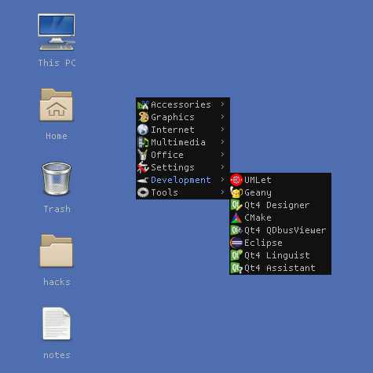

Awesome-Freedesktop
===================

-------------------------------------------------------------------
Freedesktop.org menu and desktop icons support for Awesome WM 4.x
-------------------------------------------------------------------

:Original author: Antonio Terceiro
:Maintainer: Luca CPZ
:Version: git
:License: GNU-GPL2_
:Source: https://github.com/lcpz/awesome-freedesktop

Description
-----------

This is a port of awesome-freedesktop_ to Awesome_ 4.x.

See branches_ for previous versions.

Since the introduction of Menubar_ as core library for providing Freedesktop.org menu functionalities in Awesome,
we can now avoid all the dirty work by just exploiting ``menubar.utils`` functions.

At the initial status of this port, the menu is pretty much complete, while the desktop icons are very basic,
so the long term objective will be to complete functionalities on this part too.

More specifically, the todo list is:

- A better way to handle desktop icons path
- Ability to drag and line up icons
- Event-based signals, in particular:
    - Updating trash icon according to its status
    - Dynamic update (no need to restart Awesome to see changes on desktop)

Screenshot
----------

Installation and usage
----------------------

Read the wiki_.

.. _GNU-GPL2: http://www.gnu.org/licenses/gpl-2.0.html
.. _awesome-freedesktop: https://github.com/terceiro/awesome-freedesktop
.. _Awesome: https://github.com/awesomeWM/awesome
.. _branches: https://github.com/lcpz/awesome-freedesktop/branches
.. _Menubar: https://github.com/awesomeWM/awesome/tree/master/lib/menubar
.. _wiki: https://github.com/lcpz/awesome-freedesktop/wiki
